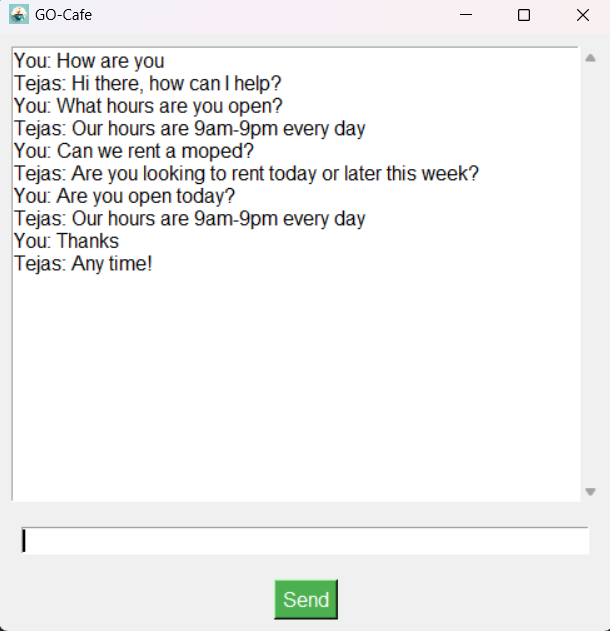

# GO-Cafe Chatbot

GO-Cafe Chatbot is a Python-based project that implements a chatbot for a coffee shop. The chatbot is designed to interact with users, answer questions, and provide information about the coffee shop's menu, opening hours, and more.

## Table of Contents

- [Features](#features)
- [Installation](#installation)
- [Usage](#usage)
- [Dependencies](#dependencies)
- [Project Structure](#project-structure)
- [Contributing](#contributing)
- [License](#license)

## Features

- **Interactive Chatbot**: Engage in conversation with the coffee shop chatbot using natural language.

- **Menu Information**: Ask about the coffee shop's menu items, including details about various beverages and snacks.

- **Opening Hours**: Inquire about the coffee shop's operating hours and special events.

- **Friendly User Interface**: The chatbot comes with a simple and user-friendly graphical interface.

## Installation

1. **Clone the Repository:**

   ```git clone https://github.com/your-username/GO-Cafe-Chatbot.git```

2. Navigate to the Project Directory:
```cd GO-Cafe-Chatbot```

3. Install Dependencies:
```pip install -r requirements.txt```
4. Run the Application:
```python gui.py```

## Usage
- Launch the chatbot application by running main.py.
- Interact with the chatbot by typing messages into the user input field.
- Type "quit" to exit the chatbot.

## Dependencies

GO-Cafe Chatbot relies on the following technologies and libraries:

- [Python](https://www.python.org/): The programming language used for the project.
- [PyTorch](https://pytorch.org/): A deep learning library used for building and training the neural network model.
- [NLTK](https://www.nltk.org/): Natural Language Toolkit, utilized for natural language processing tasks.
- [Tkinter](https://docs.python.org/3/library/tkinter.html): Python's standard GUI (Graphical User Interface) library.

Ensure that you have these dependencies installed before running the application. You can install the required Python packages using the provided `requirements.txt` file:


## Project Structure
**model.py:** Definition of the neural network model.
**nltk_utils.py:** Utility functions for natural language processing.
**intents.json:** JSON file containing chatbot intents and responses.
**data.pth:** Serialized data file containing model information.
**gui.py:** GUI-related code for the Tkinter interface.

## Screenshots


